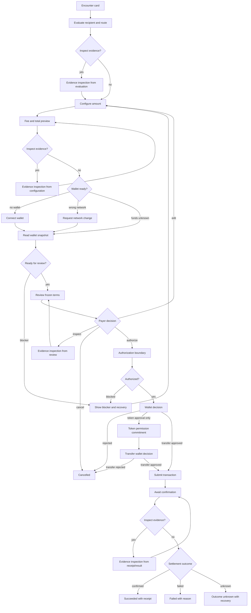
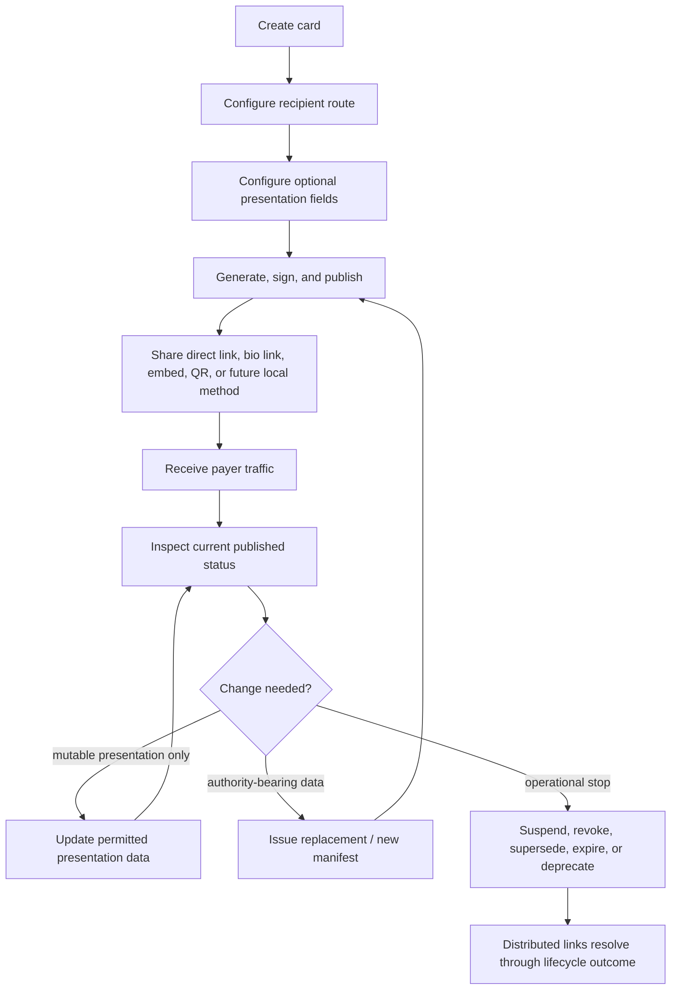

# Coin Card Interaction Architecture

**Status:** Architectural governing artifact
**Created:** 2026-07-16
**Authority:** Subordinate to `docs/architecture/constitutions/COIN_CARD_INTERACTION_CONSTITUTION.md`
**Scope:** Payer and card-holder interaction architecture for Coin Card surfaces

---

## 1. Status And Authority

**ARCHITECTURAL DECISION:** This document translates the Coin Card Interaction
Constitution into the payer and card-holder journeys, evidence flow, commitment
boundaries, state axes, and projection rules that lower-level state contracts and
presentation contracts must satisfy.

This document is not a visual design specification and not a runtime migration
patch. It governs later interaction, state, and presentation work.

Governance relationship:

```text
Mission
  -> Coin Card Interaction Constitution
      -> Coin Card Interaction Architecture
      -> Trust, lifecycle, authorization, execution, and settlement contracts
          -> Runtime and presentation implementations
```

**ARCHITECTURAL DECISION:** This interaction architecture governs payer and
card-holder journeys, information visibility, commitment boundaries, and visible
state projection. It does not supersede or weaken hardened trust, lifecycle,
authorization, provider-continuity, TOCTOU, replay-protection, or execution
contracts.

**ARCHITECTURAL DECISION:** Runtime and presentation implementations must
satisfy both the interaction architecture and the security/execution contracts.
Where an actual contradiction exists, it must be reconciled explicitly rather
than resolved by an assumed document hierarchy.

The payer's organizing question is:

> Who am I paying, what will they receive, what will leave my wallet, and what
> evidence gives me enough confidence to proceed?

## 2. System Boundaries

**ARCHITECTURAL DECISION:** The Coin Card surface owns the complete payer
interaction from presentation through transaction result.

This supersedes older parent-owned execution language where it conflicts with
this architecture. A host or embedding page may provide framing and transport,
but it must not own, alter, bypass, or become required for the payment
conversation.

| System / actor | Boundary | May do | Must not do | Status |
| --- | --- | --- | --- | --- |
| Coin Card surface | Payer interaction and payment-intent surface | present route, gather amount, connect wallet through shared modules, review, authorize, execute, show result | delegate required payer journey to host | ARCHITECTURAL DECISION |
| Host / embed page | Framing and transport | embed card, deep-link to card, provide layout context | alter reviewed terms, substitute recipient authority, bypass review, authorize execution | ARCHITECTURAL DECISION |
| Shared wallet/execution modules | Lower-level primitives | request wallet accounts, read chain/account/balance/allowance, construct approval/transfer, enforce provider continuity | redefine payer journey or visible commitments | ARCHITECTURAL DECISION |
| Manifest verifier | Integrity evidence | determine manifest/package verification state | imply recipient identity proof when evidence does not support it | EXISTING |
| Lifecycle registry | Currentness evidence | identify active, suspended, revoked, superseded, expired, or unavailable lifecycle evidence | authorize execution by itself | EXISTING |
| Presentation promotion | Card-authority gate | produce promoted presentation proof only for active/current card evidence | execute, request wallet, or set execution authority | EXISTING |
| Execution authorization | Security boundary | evaluate promoted card authority, frozen intent, and frozen wallet snapshot | create visible trust by itself, perform wallet calls | EXISTING |
| Wallet provider | Payer wallet evidence and wallet decision | provide account, chain, balance, allowance, user approval/rejection | define recipient authority or reviewed terms | EXISTING |
| Blockchain | Settlement truth | provide transaction receipt, finality, and on-chain result | prove off-chain recipient identity | EXISTING |

Direct Coin Card links, creator bio links, embedded cards, ImplicitEx-hosted
pages, horizontal projections, vertical projections, QR, NFC, and future compact
surfaces are integration methods for the same Coin Card product. They are not
separate payment products.

## 3. Actor Definitions

| Actor | Role | Primary question | Authority supplied |
| --- | --- | --- | --- |
| Payer | Person deciding whether to move money | Can I safely send money here? | amount choice, wallet decisions, cancellation |
| Card holder / merchant | Person or organization presenting the card | How do I present my payment identity or route? | recipient route configuration and publication authority |
| Host | Website, profile, app, or frame presenting the card | How do I expose this card? | transport and framing only |
| ImplicitEx | Issuer, verifier, execution rail, and registry operator as applicable | What evidence can the system establish? | package integrity, route support, lifecycle, execution policy |
| Wallet provider | Payer-controlled wallet interface | What account, chain, and wallet decision exist now? | live wallet evidence and user approval/rejection |
| Blockchain | Settlement system | What happened on-chain? | transaction finality and receipt evidence |

## 4. Existing Behavior To Reconcile

**EXISTING:** Current `/card/` runtime uses one combined state string for
presentation, evidence, wallet, execution, and settlement behavior:

```text
BOOT
MANIFEST_LOADING
VERIFIED
AMOUNT_READY
TRANSFER_INTENT_READY
REVOKED
CONNECTING
WRONG_NETWORK
SWITCHING_NETWORK
READY_TO_SEND
APPROVE_PENDING
EXECUTE_PENDING
CONFIRMED
TX_FAILED
ERROR
```

**EXISTING:** `READY_TO_SEND` currently displays a review panel, but activating
the chip immediately calls authorization and then `IX_EXECUTION.executeTransfer`.
It is not yet a durable review boundary.

**EXISTING:** The older `docs/product/coincard-constitution.md` describes an
iframe credential surface with parent-owned wallet and execution controls.

**ARCHITECTURAL DECISION:** That parent-owned execution split is historical where
it conflicts with this document. Coin Card must operate through a direct link
without a host website, so the Coin Card surface owns the payer interaction.
Shared modules may still own wallet and execution primitives.

**EXISTING:** Canonical state contracts already define orthogonal axes for view,
route, network/token, amount, funding, wallet, execution, receipt, and error.

**ARCHITECTURAL DECISION:** This architecture preserves orthogonal axes. It does
not replace the current overloaded runtime state with another oversized enum.

## 5. Canonical Payer Journey

**ARCHITECTURAL DECISION:** The payer journey is non-linear where inspection is
concerned. Evidence inspection may occur before amount entry, after amount
entry, after wallet connection, during review, or after result.

The happy path is:

1. **Encounter**
   The payer recognizes that this is a payment request or reusable payment
   destination.

2. **Evaluate**
   The payer sees recipient-facing context, payment route, network, token, and
   concise route-status language. The payer may inspect evidence. The system
   must communicate what remains unverified.

3. **Configure intent**
   The payer enters or accepts the amount the recipient receives. Fee and total
   wallet debit are calculated. No commitment has occurred.

4. **Establish wallet readiness**
   The payer connects a wallet when required. The system compares wallet chain
   state with card configuration and evaluates funds from a current wallet
   snapshot. Connecting a wallet is not commitment.

5. **Review**
   The payer reviews a frozen snapshot of recipient authority and payment
   terms. The payer may cancel, edit, or inspect evidence. Entering review does
   not authorize payment.

6. **Authorize**
   A separate deliberate action initiates authorization. The system evaluates
   frozen promoted card authority, frozen user intent, and frozen wallet
   snapshot. `AUTHORIZED` may be internal and brief.

7. **Wallet decision**
   The wallet presents external user-controlled decisions. Token approval and
   transfer approval must be distinguishable when both are required.

8. **Execute and settle**
   The system submits the transaction without changing reviewed terms. Submission
   and confirmation are distinct.

9. **Result**
   The card shows confirmed success, definitive failure, cancellation, or
   uncertain outcome with transaction evidence and recovery actions.



## 6. Canonical Card-Holder Journey

**ARCHITECTURAL DECISION:** This architecture defines the card-holder journey,
but it does not design the management UI.



**ARCHITECTURAL DECISION:** Mutable presentation edits must be distinguished
from authority-bearing changes that require a new manifest, lifecycle bundle,
version, or replacement card.

## 7. Evidence Flow

Evidence is selected progressively. Healthy evidence remains quiet and
inspectable. Failures, conflicts, revocation, expiration, or uncertainty become
prominent.

| Stage | Evidence exists | Visible by default | Inspectable | Unknowns that must remain explicit | Execution-authorizing? |
| --- | --- | --- | --- | --- | --- |
| Encounter | card surface, URL/transport, basic route claim | product identity, recipient label if legitimate, network/token | source URL, card ID | identity evidence absent for free card | no |
| Evaluate | manifest verification, route config, lifecycle result when loaded | route status in plain language | manifest/integrity/lifecycle details | person/domain/wallet-control evidence if absent | no |
| Configure intent | amount text, amount units, fee, total | amount, fee, total, recipient summary | calculation detail | wallet funds until connected/read | no |
| Wallet readiness | provider, account, chain, balance, allowance | connected wallet summary, chain/funds blocker if any | full account/chain details | live state may change before execution | no |
| Review | frozen card authority, frozen terms, wallet snapshot | recipient, address, token, network, amount, fee, total, sender | evidence and snapshot details | evidence not present at this tier | prepares authorization |
| Authorization | promoted presentation, frozen intent, frozen snapshot | usually visible as transition to wallet decision or blocker | authorization outcome if blocked | none for authorized facts; proof may be internal | yes |
| Wallet decision | wallet prompt, token approval request, or transfer request | wallet waiting state | provider request context | user decision pending | external commitment boundary |
| Settlement | tx hash, receipt, chain result | confirmed/failed/unknown result | explorer/hash/receipt | outcome if RPC/explorer unavailable | settlement truth |

Free-card language must communicate route verification, not real-world identity
verification. The card may say that the route/package is verified; it must not
say that the recipient person or organization is verified unless that evidence
exists in a higher tier.

## 8. Decision Points

| Decision | Who decides | Evidence available | Commitment created | May cancel? |
| --- | --- | --- | --- | --- |
| Continue from encounter | payer | card identity, route summary | none | yes |
| Inspect evidence | payer | available evidence set | none | yes |
| Enter amount | payer | recipient/route context | draft intent only | yes |
| Connect wallet | payer | card route and amount context | wallet visibility | yes |
| Change network | payer through wallet | required chain vs wallet chain | wallet network request | yes |
| Review | payer | route, amount, fee, total, wallet snapshot | review snapshot | yes |
| Authorize | payer initiates, system evaluates | frozen card authority, intent, wallet snapshot | execution authorization if valid | no for consumed proof; can cancel before wallet decision |
| Token approval decision | payer in wallet | wallet-rendered allowance request | external permission commitment | yes, by rejecting |
| Transfer approval decision | payer in wallet | wallet-rendered transfer request | final external payment commitment | yes, by rejecting |
| Retry | payer | failure/uncertainty evidence | new attempt or recovery flow | yes |
| Exit | payer | any current state | none unless transaction already submitted | depends on settlement state |

The system never decides that the payer trusts the destination. It presents
evidence; the payer decides whether the evidence is sufficient.

## 9. Commitment Boundary Model

**CONSTITUTIONALLY REQUIRED:** Commitment follows evidence.

| Boundary | Commitment? | Normative rule |
| --- | --- | --- |
| Browsing / encountering | no | no wallet access, approval, or transfer |
| Expanding / inspecting | no | presentation-only; preserves intent |
| Entering amount | no | reversible draft intent |
| Connecting wallet | no | wallet visibility only; no payment commitment |
| Network change request | no payment commitment | wallet-scoped chain change only |
| Entering review | review commitment only | freezes reviewed terms; no execution |
| Authorize action | security commitment | evaluates frozen card authority, intent, snapshot |
| Token approval wallet decision | external permission commitment | may create durable allowance; not a payment transfer |
| Transfer approval wallet decision | final external payment commitment | payer approves/rejects the reviewed payment transfer |
| Broadcast | execution commitment | reviewed terms must not change |
| Confirmation | settlement truth | receipt governs result |

**ARCHITECTURAL DECISION:** Entering review and authorizing payment must be
distinct events.

Entering review freezes two related structures: reviewed payment terms and a
wallet snapshot attached to review.

### Reviewed payment terms

Reviewed payment terms are the payment facts the payer is asked to evaluate.
They freeze at minimum:

- card identifier
- promoted card authority
- lifecycle evidence reference
- recipient address
- token contract
- required network
- recipient amount in atomic units
- platform fee in atomic units
- total debit in atomic units

### Wallet snapshot attached to review

The wallet snapshot is volatile wallet evidence used to evaluate readiness and
authorization. It is not a recipient payment term. It freezes at minimum:

- sender address snapshot
- observed wallet chain
- token balance
- native gas balance or gas-readiness result
- allowance state
- provider identity or continuity reference where required
- snapshot timestamp or freshness reference where supported

The wallet snapshot attached to review is the immutable authorization-time
record of wallet evidence evaluated for one authorization attempt. It is not
silently rewritten after authorization. Later execution observations may be
recorded separately, but they do not replace the authorization-time snapshot.

The review presentation must visibly answer:

1. Who or what am I paying?
2. What evidence supports that representation?
3. What address receives the funds?
4. Which token and network are being used?
5. What amount does the recipient receive?
6. What fee is charged?
7. What total leaves my wallet?
8. What remains unknown or unverified?

Editing any frozen payment term exits or invalidates the current review and
requires a new review snapshot.

Unexpected account drift, chain drift, provider drift, externally caused balance
change, allowance state inconsistent with the authorized execution plan, or
snapshot staleness invalidates or refreshes wallet readiness and may invalidate
the review's authorization eligibility. The system must never silently replace
the sender or wallet snapshot beneath an existing review. A fresh wallet
snapshot does not permit reviewed recipient or amount terms to change.

### Expected plan-owned mutations

The authorized execution plan may explicitly permit expected state transitions
caused by its own transactions. For an `APPROVE_THEN_TRANSFER` plan, expected
mutations may include:

- allowance changing from insufficient to sufficient
- native gas balance decreasing because of approval gas
- native gas balance decreasing because of transfer gas
- token balance decreasing by the authorized total debit after transfer

These effects do not alter the reviewed recipient, token, required network,
recipient amount, platform fee, or total debit. They do not require renewed
review merely because they occurred. They must remain bounded by the exact
authorized execution plan.

Approval success does not authorize a different transfer. It only permits
continuation with the exact transfer already reviewed and authorized.

Connecting a wallet is not payment commitment. A network switch is wallet
configuration, not payment commitment. Token approval may create a durable
on-chain allowance or permission; it is a real external commitment, but it is
not the payment transfer itself. Transfer approval is the final external
payer-controlled commitment to the reviewed payment.

When token approval and transfer require separate wallet decisions, Coin Card
must label and represent them separately. The card must not state or imply that
funds were sent merely because token approval succeeded. A failed, rejected, or
uncertain token approval must not be represented as a failed transfer. A
confirmed token approval followed by a rejected transfer may leave a surviving
allowance, and the result/recovery model must account for that fact.

## 10. State-Axis Definitions

**ARCHITECTURAL DECISION:** Coin Card state is modeled as orthogonal axes.
Visible card state is a projection from these axes.

The names below are architectural concepts. Existing contract/runtime values
must not be renamed merely for aesthetic consistency.

Values within one axis should normally be mutually exclusive. Simultaneous
conditions must be represented across separate axes.

### Interaction phase

| Concept | Meaning | Existing values to reconcile |
| --- | --- | --- |
| `PRESENTED` | card is encountered; no payment configuration required yet | `BOOT`, `MANIFEST_LOADING`, historical `BADGE` |
| `CONFIGURING` | payer is evaluating route and/or entering amount | `VERIFIED`, `AMOUNT_READY`, `TRANSFER_INTENT_READY`, `PREVIEW_READY` |
| `READY_FOR_REVIEW` | all local prerequisites allow review | `TRANSFER_INTENT_READY`, `EXECUTION_READY` |
| `REVIEWING` | frozen review snapshot is visible; authorization not yet initiated | current `READY_TO_SEND` is closest but insufficient |
| `AUTHORIZATION_IN_PROGRESS` | authorization is evaluating frozen inputs | `authorizeExecution()` |
| `WALLET_DECISION_PENDING` | wallet approval/rejection or network decision is active | `CONNECTING`, `SWITCHING_NETWORK`, approval/transfer requested |
| `EXECUTION_IN_PROGRESS` | approval, transfer submission, or confirmation is active | `APPROVE_PENDING`, `EXECUTE_PENDING`, submitted states |
| `RESULT` | terminal or recoverable result is shown | `CONFIRMED`, `TX_FAILED`, settlement states |

Interaction phase is a journey phase. It is not the source of truth for
evidence, wallet readiness, authorization, execution, or settlement.

### Base presentation mode

| Concept | Meaning |
| --- | --- |
| `COLLAPSED` | compact acceptance/payment identity mark; no wallet/action initiation |
| `EXPANDED` | main payment interaction surface |
| `REVIEW` | frozen review terms are the primary presentation |
| `RECEIPT` | receipt/result evidence is the primary presentation |

### Inspection disclosure

| Concept | Meaning |
| --- | --- |
| `CLOSED` | evidence details are not expanded |
| `EVIDENCE_DETAILS_OPEN` | evidence details are visible as an overlay/panel/disclosure |

Inspection disclosure can coexist with expanded configuration, review, and
receipt presentation. It is not a replacement for review.

### Integrity

| Concept | Existing vocabulary | Meaning |
| --- | --- | --- |
| `VERIFICATION_UNAVAILABLE` | `VERIFICATION_UNAVAILABLE` | missing/unsupported verification; execution disabled |
| `ASSET_HASHES_PASSED` | `ASSET_HASHES_PASSED` | development/pass-through evidence; execution disabled |
| `INTEGRITY_FAILED` | `INTEGRITY_FAILED` | protected evidence invalid; fail closed |
| `VERIFIED` | `VERIFIED` | issued package/signature evidence valid |

### Lifecycle

| Concept | Existing vocabulary | Meaning |
| --- | --- | --- |
| `ACTIVE` | `LIFECYCLE_ACTIVE` | current lifecycle permits promotion |
| `SUSPENDED` | `LIFECYCLE_CARD_SUSPENDED` | operationally paused/blocked |
| `REVOKED` | `LIFECYCLE_CARD_REVOKED`, manifest revoked | terminal or blocked lifecycle |
| `SUPERSEDED` | `LIFECYCLE_MANIFEST_SUPERSEDED` | replacement exists or current manifest no longer current |
| `EXPIRED` | `LIFECYCLE_EXPIRED` | lifecycle/effective window no longer valid |
| `UNAVAILABLE` | lifecycle unavailable/authority unavailable | lifecycle cannot be resolved |
| other contract outcomes | existing lifecycle contracts | preserve exact machine reason |

### Presentation promotion / card authority

| Concept | Existing vocabulary | Meaning |
| --- | --- | --- |
| `NOT_EVALUATED` | no promotion result | card authority not yet promoted |
| `PRESENTATION_PROMOTED` | `PRESENTATION_PROMOTED` | only positive authority that may contribute to authorization |
| `PROMOTION_BLOCKED` | promotion blocked outcomes | presentation cannot contribute card authority |

### Evidence resolution

| Concept | Meaning |
| --- | --- |
| `CONSISTENT` | selected evidence is coherent for the requested card/manifest |
| `CONFLICT` | duplicate, mismatched, contradictory, stale, or impossible evidence |
| `UNAVAILABLE` | evidence source, verifier, or resolver is unavailable |

Evidence conflict is not an integrity value and not a lifecycle value. It is an
independent resolution condition.

### Wallet connection

| Concept | Existing vocabulary | Meaning |
| --- | --- | --- |
| `NOT_CONNECTED` | `DISCONNECTED` | no wallet account evidence |
| `CONNECTING` | `CONNECTING` | wallet permission pending |
| `CONNECTED` | account present | account evidence exists |
| `CONNECTION_REJECTED` | wallet rejected | payer rejected connection |
| `CONNECTION_UNAVAILABLE` | wallet missing/unavailable | provider unavailable |

### Network compatibility

| Concept | Existing vocabulary | Meaning |
| --- | --- | --- |
| `UNKNOWN` | chain read unavailable | wallet chain not known |
| `MATCHED` | connected ready chain | wallet chain matches card chain |
| `MISMATCHED` | `WRONG_NETWORK`, `CONNECTED_WRONG_NETWORK` | wallet chain differs from card chain |
| `SWITCH_REQUESTED` | `SWITCHING_NETWORK` | wallet chain switch requested |
| `SWITCH_REJECTED` | network switch rejected/failed | switch did not complete |

### Funding readiness

| Concept | Existing vocabulary | Meaning |
| --- | --- | --- |
| `UNKNOWN` | funding `UNKNOWN` | balance/gas/allowance not fully evaluated |
| `SUFFICIENT` | funding `SUFFICIENT` | funds/gas readiness sufficient for reviewed terms |
| `INSUFFICIENT_TOKEN` | `INSUFFICIENT_USDC` | token balance insufficient |
| `INSUFFICIENT_GAS` | `INSUFFICIENT_GAS` | gas readiness insufficient |
| `UNAVAILABLE` | balance/RPC unavailable | funding evidence unavailable |

### Provider continuity

| Concept | Existing vocabulary | Meaning |
| --- | --- | --- |
| `NOT_ESTABLISHED` | before snapshot/provider binding | no continuity reference |
| `ESTABLISHED` | same provider/session used | snapshot and execution provider continuity held |
| `MISMATCH` | `PROVIDER_MISMATCH` | provider continuity failed |

### Review snapshot

| Concept | Meaning |
| --- | --- |
| `ABSENT` | no review snapshot exists |
| `CURRENT` | review snapshot matches current reviewed terms and eligible wallet evidence |
| `INVALIDATED` | reviewed terms or required evidence changed |
| `STALE` | review snapshot requires freshness check or renewal |

### Authorization axis

| Concept | Existing vocabulary | Meaning |
| --- | --- | --- |
| `NOT_REQUESTED` | none / pre-authorization | no authorization attempt |
| `EVALUATING` | call to `authorizeExecution()` | frozen inputs being evaluated |
| `EXECUTION_AUTHORIZED` | `EXECUTION_AUTHORIZED` | branded authority for one exact attempt |
| blocked | `EXECUTION_*` blocked outcomes | authorization failed with reason |
| `PROOF_CONSUMED` | `AUTHORIZATION_PROOF_CONSUMED` | proof already submitted |

### Allowance / token approval

| Concept | Existing vocabulary | Meaning |
| --- | --- | --- |
| `NOT_REQUIRED` | `TRANSFER_ONLY` plan | existing allowance is sufficient |
| `REQUIRED` | `APPROVE_THEN_TRANSFER` plan | token approval is needed |
| `WALLET_DECISION_PENDING` | approval prompt requested | payer wallet decision pending |
| `SUBMITTED` | approval hash returned | token approval submitted |
| `CONFIRMED` | approval receipt success | allowance permission confirmed |
| `REJECTED` | wallet rejection | payer rejected token approval |
| `FAILED` | approval failed/reverted | token approval did not succeed |
| `OUTCOME_UNKNOWN` | post-approval uncertainty | approval outcome cannot be confirmed |

### Transfer execution

| Concept | Existing vocabulary | Meaning |
| --- | --- | --- |
| `NOT_STARTED` | no approval/transfer requested | no wallet write requested |
| `WALLET_DECISION_PENDING` | transfer prompt requested | payer wallet decision pending |
| `SUBMISSION_PENDING` | transfer request being submitted | wallet/provider submission in progress |
| `SUBMITTED` | `TRANSFER_PENDING`, submitted | transaction hash or broadcast evidence exists |
| `REJECTED` | wallet rejected | payer rejected transfer |
| `FAILED` | failed execution path | deterministic transfer execution failure |

### Settlement axis

| Concept | Existing vocabulary | Meaning |
| --- | --- | --- |
| `NOT_SUBMITTED` | no hash | no transaction submitted |
| `CONFIRMATION_PENDING` | submitted/pending | broadcast/hash exists; awaiting confirmation |
| `CONFIRMED` | `confirmed`, `CONFIRMED` | on-chain success |
| `FAILED` | on-chain failed/reverted | definitive failure |
| `OUTCOME_UNKNOWN` | `outcome_unknown` | hash exists but finality unavailable |
| `UNCLEAR` | `unclear` | insufficient reliable network evidence |

`CONFIRMATION_PENDING` begins only after a transaction has been submitted or
broadcast. Waiting for wallet approval, token approval, transfer prompt, and
confirmation are separate waiting states.

## 11. Derived Interaction-State Projection

Visible state is computed from axes using precedence, not assigned as a single
source of truth.

Projection precedence:

1. Integrity failure, lifecycle block, promotion block, or evidence conflict
   prevents execution and overrides ordinary readiness presentation.
2. A submitted transaction with unresolved settlement projects confirmation or
   outcome uncertainty regardless of current wallet connection.
3. A current review snapshot projects review unless authorization, wallet
   decision, execution, or settlement has progressed beyond it.
4. Wallet/network/funding blockers project only when no stronger evidence,
   execution, or settlement state takes precedence.
5. Presentation disclosure may change without changing underlying authority,
   intent, wallet, authorization, execution, or settlement state.

| Projected state | Required axes | Primary user question | Available actions | Prohibited actions |
| --- | --- | --- | --- | --- |
| Presented | presentation collapsed/expanded; evidence not failed terminal | What is this? | inspect, expand, present/share | wallet request, approval, transfer |
| Configuring | evidence executable or inspectable; amount not frozen | What am I paying, and how much? | edit amount, inspect evidence, connect wallet where meaningful | approval, transfer |
| Wallet required | valid draft; wallet not connected | Which wallet pays? | connect, inspect, edit | approval, transfer |
| Wrong network | connected wallet chain differs | What needs correction? | switch network, edit, cancel | transfer |
| Insufficient funds | valid draft/review but insufficient funding | Can this wallet pay? | edit amount, switch wallet, cancel | approval, transfer |
| Ready for review | route, amount, wallet readiness sufficient | Am I ready to review? | enter review, edit, inspect | execute |
| Reviewing | frozen review snapshot present | Do I intend to pay these exact terms? | authorize, cancel, edit, inspect | mutate frozen terms silently |
| Awaiting wallet decision | authorization succeeded or wallet request active | What decision is pending in wallet? | approve/reject in wallet | edit reviewed terms, submit alternate terms |
| Confirmation pending | transaction broadcast/submitted | Did the chain confirm it? | wait, inspect hash | retry without outcome evidence |
| Result | settlement or cancellation/failure known | What happened? | view receipt, retry if safe, start new intent | overwrite receipt facts |
| Evidence blocked | integrity/lifecycle/evidence failed | Why can’t this card proceed? | inspect, exit | connect wallet, approve, transfer |

Visible states such as Wallet required, Wrong network, Insufficient funds, Ready
for review, Reviewing, Waiting for wallet, Confirmation pending, Evidence
blocked, and Result are projections. They are not canonical machine states.

## 12. Information Visibility By State

| State | Must be visible | May be collapsed | Wallet data needed? | May proceed toward execution? | Uncertainty shown? |
| --- | --- | --- | --- | --- | --- |
| Presented | recipient/route summary, network/token, route-status language | detailed evidence, full address | no | no | if card unavailable |
| Configuring | recipient context, amount, fee, total, network/token | full evidence detail | no | no | amount/route uncertainty |
| Wallet required | draft amount/total, recipient, connect action | evidence detail | no | no | wallet absence |
| Wrong network | required network, detected mismatch | evidence detail | yes | no | yes |
| Insufficient funds | total debit, available funding blocker | deep evidence detail | yes | no | yes |
| Ready for review | recipient, amount, fee, total, sender summary | detailed evidence | yes | no, must enter review | blockers if any |
| Reviewing | frozen recipient, full/inspectable address, token/network, amount, fee, total, sender, unknowns | deep cryptographic detail | yes | yes, via separate authorize action | yes |
| Awaiting wallet decision | pending wallet action, reviewed terms summary | nonessential details | yes | already authorized or pending | yes |
| Confirmation pending | tx hash if known, reviewed terms, pending status | evidence details | no | already submitted | yes |
| Result | outcome, receipt/hash, recipient, amount, fee, total, funds-moved status | detailed evidence | no | new intent only | if unresolved |
| Evidence blocked | blocker reason, disabled transfer state | nonessential data | no | no | yes |

## 13. Failure And Recovery Model

| Failure / uncertainty | Class | User meaning | Recovery |
| --- | --- | --- | --- |
| verification unavailable | evidence unavailable | card cannot currently prove package integrity | inspect, retry load, exit |
| integrity failed | evidence invalid | card does not match issued package | no execution; exit |
| lifecycle revoked/expired/superseded | operational status | card is not currently usable | inspect status; use replacement if supplied |
| evidence conflict | evidence contradiction | system cannot reconcile authority | fail closed; inspect/exit |
| malformed amount | form error | amount cannot be used | correct amount |
| wrong network | wallet mismatch | connected wallet is on wrong chain | switch network or cancel |
| insufficient USDC/gas | funding blocker | wallet cannot cover debit or gas | reduce amount, use another wallet, fund wallet |
| wallet connection rejected | user cancellation | wallet was not connected | retry connection if intended |
| provider mismatch | wallet continuity failure | wallet session changed after snapshot | fresh snapshot/review required |
| TOCTOU account/chain drift | wallet drift | live wallet no longer matches reviewed snapshot | fresh snapshot/review required |
| token approval rejected | permission cancellation | token allowance was not granted | review can remain if still current; new authorization proof required if consumed |
| token approval failed/unknown | permission failure/uncertainty | allowance may not exist or may be uncertain | do not represent as transfer failure; inspect/retry safely |
| token approval confirmed, transfer rejected | partial external commitment | allowance may survive although payment was not sent | show surviving allowance possibility and next safe action |
| token approval pending | pre-transfer execution | approval not settled yet | wait; do not claim funds moved |
| transfer rejected | payment cancellation | payment transfer was rejected before broadcast | payment not sent; new authorization required if proof consumed |
| transfer submitted | post-broadcast | transaction is awaiting chain result | preserve hash; wait |
| outcome unknown | settlement uncertainty | hash exists but final result unknown | verify explorer/RPC before retry |
| unclear | insufficient transaction evidence | system cannot classify attempt | preserve local facts; avoid false certainty |
| on-chain failed | definitive chain failure | transaction reverted or failed | show reason; retry only if safe |

After wallet rejection or another post-consumption failure:

- the consumed authorization proof cannot be reused
- a new deliberate authorization action is required
- a fresh wallet snapshot must be obtained when required by current contracts
- renewed visible review is mandatory when reviewed terms changed, wallet sender
  or chain changed, card authority/lifecycle/evidence changed, or the review
  snapshot became stale or invalidated
- unchanged reviewed terms may remain visible when they are still current; the
  payer should not be forced to re-enter or edit them solely because a wallet
  prompt was rejected

This does not weaken the existing proof-consumption order.

## 14. Core Interaction Invariants

**CONSTITUTIONALLY REQUIRED:** The following invariants govern every Coin Card
projection and implementation:

- Encountering, expanding, or inspecting a card cannot initiate a wallet write.
- Entering or editing an amount cannot initiate authorization or execution.
- Entering review cannot initiate authorization or execution.
- Only a separate deliberate action from a current review may request
  authorization.
- Only valid promoted card authority may contribute to authorization.
- No host surface may substitute recipient authority or reviewed terms.
- Inspection must preserve valid draft and review state unless underlying
  evidence changes.
- Evidence inspection is observational. It must not independently create,
  mutate, invalidate, authorize, execute, or clear payment intent.
- Any reviewed-term mutation invalidates the current review.
- Wallet/account/chain/provider drift must be exposed and reconciled before
  execution.
- Expected state mutations caused by the exact authorized execution plan do not
  invalidate the reviewed payment. Unexpected external drift must be detected
  and reconciled according to the existing security and execution contracts.
- The authorization-time wallet snapshot remains part of the immutable attempt
  record; later execution observations may be recorded separately rather than
  replacing that snapshot.
- A confirmed token approval may continue only into the exact transfer bound to
  the same authorization attempt and execution plan.
- Token approval cannot be reused by Coin Card as authority for a different
  recipient, amount, token, network, or payment attempt.
- If continuation cannot be proven safe, Coin Card must fail closed and require
  a new authorization path.
- Token approval success is not transfer success.
- Transaction submission is not transaction confirmation.
- Unknown settlement must remain unknown until reliable evidence resolves it.
- Compact form factors may reduce disclosure density but may not reduce security
  or commitment requirements.

Review may be invalidated if evidence changes, expires, becomes conflicted, or
loses promoted authority while inspection is occurring.

## 15. Form-Factor Invariants

| Projection | May reduce | Must preserve |
| --- | --- | --- |
| Horizontal card | visual density | recipient authority, token/network, fee math, review terms, evidence semantics |
| Vertical card | layout shape | same interaction axes and authorization gate |
| Embedded card | surrounding context | direct-card functionality and host non-authority |
| Direct link | host framing | complete payer journey |
| Creator bio link | available viewport | same route and evidence semantics |
| QR | visible detail before scan | resolves to same Coin Card product |
| NFC / local method | transport mechanics | same evidence, review, authorization, execution boundaries |
| Compact surface | detailed evidence visibility | no reduction in authorization requirements |

Amount-prefilled QR or NFC behavior is deferred. The architecture should allow
future signed or bounded payment-intent parameters, but unsigned transport
parameters must not silently replace reviewed terms or recipient authority.

## 16. Existing / Required / Proposed / Deferred Reconciliation

| Topic | Existing behavior | Constitutionally required | Architectural decision | Proposed runtime migration / deferred |
| --- | --- | --- | --- | --- |
| Interaction ownership | older docs split iframe credential and parent execution; current card executes in-card | architecture supports interaction, not replacing it | Coin Card owns complete payer interaction | amend old product constitution later |
| State model | current runtime uses one combined `data-state` | states established by evidence | use orthogonal axes and projection | migrate runtime away from overloaded state |
| Review boundary | `READY_TO_SEND` immediately authorizes/executes on chip | commitment follows evidence | review and authorize are distinct events | split configure -> review -> authorize |
| Trust language | `VERIFIED` can dominate UI | trust earned through evidence | do not model trust as system state | revise copy/presentation later |
| Free-card meaning | route verification docs exist | authority has owner | free verification means route, not person identity | paid-tier identity evidence deferred |
| Inspection | historical inspect existed; current simplified | conversation before control | inspection optional and non-linear | restore inspect affordance via later UI slice |
| Amount placement | amount appears immediately after verified | inputs appear when meaningful | route/recipient context precedes amount meaning | exact layout deferred |
| Wallet states | provider continuity hardened | preserve agency | sender evidence is wallet evidence | display sender/pay-from later |
| Healthy evidence | detailed machinery exists | reveal progressively | quiet by default; inspectable | exact visual treatment deferred |
| Waiting states | current pending labels compressed | every state changes conversation | distinguish wallet, approval, submission, confirmation | refine execution projections later |
| QR/direct links | QR opens card URL | transport is not product | QR/link/embed share architecture | amount-prefill rules deferred |

## 17. Deferred Decisions

The following are intentionally deferred:

- exact paid-tier identity-evidence product design
- exact domain, identity, and wallet-control evidence presentation
- amount-prefilled QR rules
- NFC discovery protocol
- management-dashboard visual design
- exact horizontal and vertical layouts
- exact copy for every evidence-inspection detail row
- production key-management UX and recovery administration

## 18. Smallest Next Implementation Slice

**PROPOSED RUNTIME MIGRATION:** Split the current compressed
`configure -> review -> authorize/execute` flow into an explicit
`configure -> review -> authorize` interaction boundary.

Acceptance criteria for that slice:

- entering review freezes reviewed terms without authorizing execution
- review visibly includes recipient, address access, token/network, amount, fee,
  total debit, sender evidence when connected, and unknown/unverified facts
- editing any frozen payment term exits or invalidates review
- a separate deliberate action initiates authorization
- authorization still uses the existing promoted presentation, frozen intent,
  frozen wallet snapshot, proof-consumption, provider-continuity, and TOCTOU
  semantics
- no trust, signing, lifecycle, manifest, contract, or execution semantics change

This is not a broad visual redesign. It is the smallest slice that restores the
durable commitment boundary required by the Interaction Constitution.
